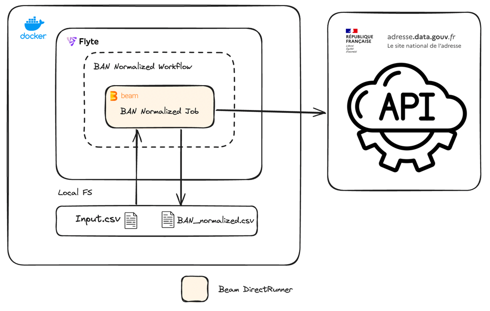

# Longue Vie aux objets data pipelines

## 1. Data
Le projet utilise le fichier de données suivant, stocké dans `src/resources/POI_sample_addresses_and_locations.csv`
### Output 

Fichier CSV d'output avec la même structure que l'input tout en assurant que les adresses sont 
valides et suivent le format de la BAN (Base Adresse Nationale), et que les latitudes et 
longitudes sont correctes.
le fichier d'output est stocké localement dans `output/`
### Structure

```csv
identifiant_unique,adresse,adresse_complement,code_postal,ville,st_x,st_y
```

## 2. Implementation


Ce projet utilise le SDK Python Apache Beam pour construire un pipeline qui s'exécute sur 
le DirectRunner :

- ban_normalization_job.py

Cette pipeline est orchestrée avec Flyte.

Flyte est packagé dans un Dockerfile, permettant d'exécuter n'importe quel workflow localement. De 
plus, des compteurs Beam sont utilisés pour collecter des métriques des jobs Beam, 
ouvrant la voie au scaling de ces pipelines avec Flink ou Dataflow et à l'intégration des 
métriques de jobs dans Prometheus ou DataDog.

Enfin, une configuration avec pré-commit est en place pour garantir le style et le formatage du 
code pour chaque commit.
Un makefile est dipsonible pour run le workflow en une seule commande `make run`
## 3. Scaling

Pour le scaling de cette pipeline, plusieurs fondations sont déjà en place. En utilisant Beam et 
Flyte,
il est 
possible avec très peu d'efforts de faire fonctionner les pipelines sur Flink ou Spark Runner et de 
stocker les données dans un stockage de type Blob comme HDFS ou S3.

Côté orchestration, nous utilisons Flyte (flyte.org), le scaling est possible en utilisant 
Kubernetes, grace à Flyte deployé sur kubernetes on pourrait avoir une capacité de scheduling 
fiable et scalable.

Enfin, ce qui suit n'est pas une liste exhaustive pour la mise en production de ce code, mais voici quelques éléments supplémentaires à aborder :

- Améliorer les sanity checks sur le fichier d'entrée.
- Assurer que les tâches Flyte sont idempotentes en intégrant la date d'execution.
- Déployer le workflow via l'Intégration Continue (CI).
- Implémenter la validation des compteurs.
- Ajouter des sensors pour les inputs dans le workflow flyte.
- Définir une option de pipeline Beam pour activer d'autres runner scalable comme Spark.
- Augmenter la couverture des docstrings et des unit tests


## Running the Project
Configurez un nouvel environnement virtuel avec Python 3.9, puis :

- Run `Make install` pour installer les exigences de développement.
- Run `Make run` pour lancer le workflow Flyte exécutant la pipeline BAN normalization.
- Run `Make test` pour lancer les tests.

